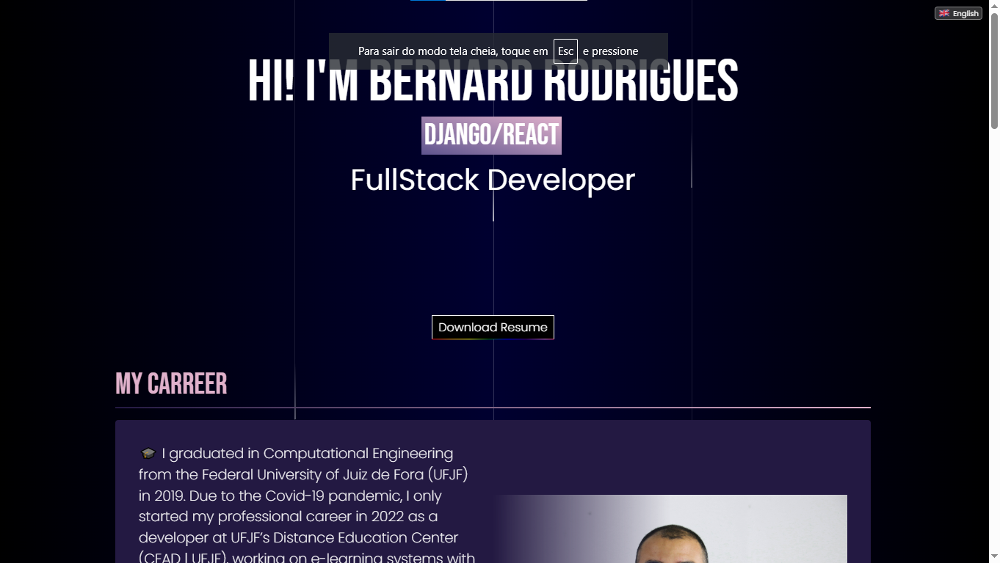
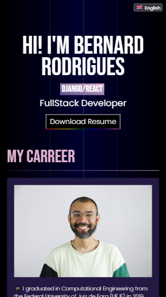

# Portfolio

A static website portfolio showcasing my personal websites and applications with beautiful animations and dynamic content generation.

## 🌟 Features

- **Jinja Components** - Modular templating system for easy maintenance
- **SASS Styling** - Advanced CSS with variables, nesting, and mixins
- **Animations** - Interactive UI elements with custom animations
- **Automatic Screenshots** - Python utility to capture and add website screenshots
- **Responsive Design** - Fully responsive across desktop and mobile devices

## 📂 Project Structure

```
├───assets
│   ├───files
│   ├───images
│   └───screenshots
├───sass
├───styles
└───templates
    └───components
```

## 🔧 Installation

### Prerequisites

- Python 3.x
- Node.js and npm

### Setup

1. Clone the repository:
   ```bash
   git clone https://github.com/bernard-rodrigues/portifolio.git
   cd portifolio
   ```

2. Create a virtual environment:
   ```bash
   python -m venv .env
   ```

3. Activate you virtual environment (Windows):
    ```pwsh
    .\env\Scripts\activate
    ```

4. Activate you virtual environment (Linux/Mac):
   ```bash
   source ./env/bin/activate
   ```

5. Install Python dependencies:
   ```bash
   pip install -r requirements.txt
   ```

6. Install Node.js dependencies:
   ```bash
   npm install
   ```

## 🚀 Usage

### Basic Run

To run the portfolio website locally:

```bash
python app.py
```

This will create a static HTML file with the information provided by your `data.json` file.

### Generate Screenshots

To automatically capture screenshots of the websites in your portfolio and add them to the project cards:

```bash
python app.py 1
```

This will:
1. Visit each website listed in your portfolio
2. Capture a screenshot of each site
3. Save them to the `assets/screenshots` directory
4. Update the project cards with the new screenshots

## 🛠️ Technologies Used

- **HTML/CSS/JavaScript** - Front-end fundamentals
- **Jinja2** - Templating engine for component-based development
- **SASS** - CSS preprocessor for advanced styling
- **BeautifulSoup** - For HTML formatting and parsing
- **Python** - Backend processing and screenshot utility

## 👀 Demo

Check out the live demo of the portfolio at:  
[bernard-rodrigues.github.io/portifolio](http://bernard-rodrigues.github.io/portifolio)

## 📸 Screenshots





## 🤝 Contributing

Contributions, issues, and feature requests are welcome! Feel free to check [issues page](https://github.com/bernard-rodrigues/portifolio/issues).

## 📝 License

This project is [MIT](https://choosealicense.com/licenses/mit/) licensed.

## 📧 Contact

Bernard Rodrigues - [GitHub](https://github.com/bernard-rodrigues)

Project Link: [https://github.com/bernard-rodrigues/portifolio](https://github.com/bernard-rodrigues/portifolio)