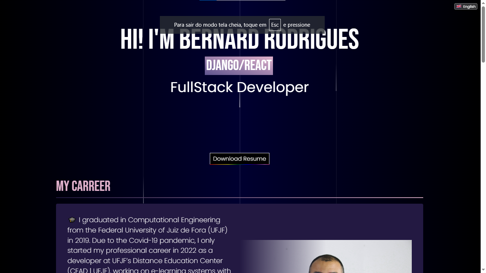
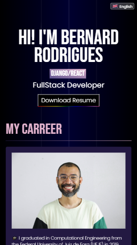

# Portfolio | Bernard Rodrigues

Um portfólio online estático que apresenta projetos pessoais e experiência profissional, com geração de conteúdo dinâmico e capturas de tela automatizadas.

## 📑 Sumário
- [Descrição do Projeto](#descrição-do-projeto)
- [Tecnologias Principais](#tecnologias-principais)
- [Funcionalidades](#-funcionalidades)
- [Pré-requisitos](#pré-requisitos)
- [Instalação](#instalação)
- [Configuração de Dados](#configuração-de-dados)
- [Execução](#-execução)
  - [Desenvolvimento (SASS)](#desenvolvimento-sass)
  - [Geração do Site (Static Site Generator)](#geração-do-site-static-site-generator)
  - [Captura de Screenshots](#captura-de-screenshots)
- [Estrutura do Projeto](#-estrutura-do-projeto)
- [Demo](#-demo)
- [Contribuição](#-contribuição)
- [Licença](#-licença)
- [Contato](#-contato)

## Descrição do Projeto
Este projeto é um gerador de portfólio estático que utiliza **Python** e **Jinja2** para processar dados de um arquivo JSON e gerar uma interface web moderna e responsiva. O sistema também conta com um utilitário de captura automática de screenshots para manter o portfólio sempre atualizado com as versões mais recentes dos projetos listados.

## Tecnologias Principais
- **Frontend:** HTML5, SASS (CSS Preprocessor), JavaScript, JQuery.
- **Backend/Tooling:** Python 3, Jinja2 (Templating), BeautifulSoup4 (HTML Formatting).
- **Automação:** Selenium (Web Scraping/Screenshots).

## 🌟 Funcionalidades
- **Componentes Jinja** - Sistema modular de templates para fácil manutenção.
- **Estilização com SASS** - CSS avançado com variáveis, aninhamento e mixins.
- **Geração Dinâmica** - Conteúdo centralizado no `data.json`.
- **Screenshots Automáticos** - Utiliza Selenium para capturar imagens dos sites em tempo real.
- **Design Responsivo** - Totalmente adaptado para dispositivos móveis e desktop.

## Pré-requisitos
Antes de começar, você precisará ter instalado em sua máquina:
- [Python 3.x](https://www.python.org/)
- [Node.js e npm](https://nodejs.org/) (para o SASS)
- [Google Chrome](https://www.google.com/chrome/) (necessário para o Selenium/Screenshots)

## Instalação

1. Clone o repositório:
   ```bash
   git clone https://github.com/bernard-rodrigues/portifolio.git
   cd portifolio
   ```

2. Configure o ambiente virtual Python:
   ```bash
   # Windows
   python -m venv venv
   .\venv\Scripts\activate

   # Linux/Mac
   python3 -m venv venv
   source venv/bin/activate
   ```

3. Instale as dependências:
   ```bash
   # Dependências Python
   pip install -r requirements.txt

   # Dependências Node (SASS)
   npm install
   ```

## Configuração de Dados
Todas as informações exibidas no portfólio (bio, tecnologias, experiências e projetos) são gerenciadas através do arquivo `data.json`.
- **Atenção:** Certifique-se de que os links dos projetos no `data.json` estão acessíveis se desejar utilizar a função de screenshots.

## 🚀 Execução

### Desenvolvimento (SASS)
Para monitorar alterações nos arquivos SASS e compilar automaticamente para CSS:
```bash
npm run sass
```

### Geração do Site (Static Site Generator)
Para gerar o arquivo `index.html` final com base nos dados do `data.json`:
```bash
python app.py
```

### Captura de Screenshots
Para atualizar as imagens dos projetos automaticamente (requer conexão com a internet):
```bash
python app.py 1
```
*Este comando percorrerá todos os links de projetos no `data.json`, capturará uma screenshot e salvará em `assets/screenshots/`.*

## 📂 Estrutura do Projeto
```text
├── assets/             # Recursos estáticos (imagens, favicons, PDFs)
│   ├── screenshots/    # Screenshots geradas automaticamente
│   └── images/         # Logos e ícones de tecnologias
├── sass/               # Arquivos fonte SASS (.scss)
├── styles/             # CSS compilado e reset
├── templates/          # Templates Jinja2
│   └── components/     # Componentes modulares (bio, projetos, etc.)
├── app.py              # Script principal de geração e screenshots
├── data.json           # Fonte de dados do portfólio
└── template.html       # Estrutura base do template
```

## 👀 Demo
Confira a versão online em:  
[bernard-rodrigues.github.io/portifolio](http://bernard-rodrigues.github.io/portifolio)

## 📸 Screenshots



## 🤝 Contribuição
Contribuições são muito bem-vindas! Sinta-se à vontade para abrir uma [Issue](https://github.com/bernard-rodrigues/portifolio/issues) ou enviar um Pull Request.

## 📝 Licença
Este projeto está sob a licença [MIT](https://choosealicense.com/licenses/mit/).

## 📧 Contato
Bernard Rodrigues - [GitHub](https://github.com/bernard-rodrigues) | [LinkedIn](https://linkedin.com/in/bernard-rodrigues)
